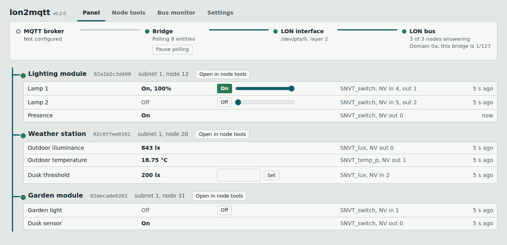
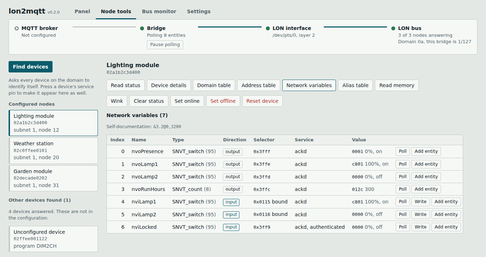
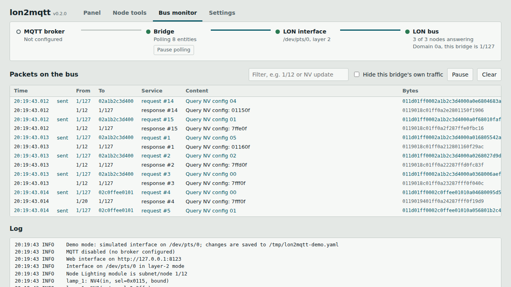

# lon2mqtt

A bridge between a **LonWorks (ISO/IEC 14908, LonTalk)** network and **MQTT**, with
**Home Assistant discovery**, a **web interface** and **NodeUtil-style diagnostics**.

It talks directly to an EnOcean/Echelon USB network interface running **MIP/U61 firmware**
(for example the **U10 FT rev B**) through its FTDI serial port. No kernel driver, no `lonifd`
daemon, no LON network interface and no LNS/OpenLNS license are needed. It runs in an
unprivileged LXC container or on a Raspberry Pi, as long as `/dev/ttyUSB0` is available.

> Status: early. The bridge (read, write, polling) has been used with a U10 FT rev B on an
> FT-10 network. The web interface and the diagnostics in `lonutil.py` are checked against a
> simulator built from the open-source LON stack's message formats, and have had little
> exposure to real devices. The software sends real network-management messages: use it at
> your own risk.



## What is in the box

| File | What it does |
|---|---|
| `lon2mqtt.py` | The core: serial link, LonTalk packets, SNVT codecs, the MQTT bridge. Runs on its own as a headless service and has a small CLI (`scan`, `read`, `write`, `sniff`). |
| `lonutil.py` | Node diagnostics as a library and CLI: find devices, service-pin listener, status, device details, domain / address / NV / alias tables, self-identification data, read memory, wink, online / offline / reset. |
| `lonweb.py` + `web/index.html` | Web interface. Runs the bridge and adds a panel, the configuration editor, the diagnostics and a bus monitor. Standard library only. |
| `lonsim.py` | A simulated interface with a few devices, for the tests and for `lonweb.py --demo`. |

`lonutil.py` and `lonweb.py` import `lon2mqtt.py`; nothing else is required beyond
`pyyaml` and `paho-mqtt`.

## Features

- Reads network variables with the network-management **NV Fetch** service (no bindings needed).
- Writes network variables with an **acknowledged explicit NV update**, using the selector
  reported by the node itself (**Query NV Config**), so it works for bound and unbound inputs.
- Per-entity polling intervals, plus **event-driven refresh**: the interface runs in layer 2, so
  when a bound NV update (e.g. a wall switch talking to a dimmer) is seen on the bus, the
  affected entity is re-read immediately.
- A device that stops answering is backed off (5 s, 10 s … 60 s) so it cannot delay commands
  and the polling of other devices.
- Home Assistant entities: `light` (dimmable or on/off), `switch`, `binary_sensor`, `sensor`,
  `number`. Availability (LWT) and HA birth-message handling included.
- SNVT codecs: `SNVT_switch`, `SNVT_lux`, `SNVT_temp_p`, `SNVT_temp`, `SNVT_lev_percent`,
  `SNVT_lev_cont`, `SNVT_count`, `SNVT_power`, `SNVT_elec_kwh`, `SNVT_press_p`, `SNVT_speed`,
  `SNVT_occupancy`, and `raw` (hex) for anything else.

## Try it without hardware

```bash
pip install -r requirements.txt
python3 lonweb.py --demo
```

Open <http://127.0.0.1:8099>. The demo runs against simulated devices; what you save goes to
a file in the temporary directory.

## Installation

```bash
git clone https://github.com/<you>/lon2mqtt.git
cd lon2mqtt
pip install -r requirements.txt      # pyyaml, paho-mqtt
cp config.example.yaml config.yaml   # or start empty and fill it in from the web interface
```

The kernel's `ftdi_sio` driver exposes the interface as `/dev/ttyUSBx` (USB ID `0920:7500`).
Do **not** load the EnOcean `u61.ko` line discipline: it takes over the port.

The user running the bridge needs access to the serial port (`root`, or membership in the
`dialout` group). Only one process can own the port: run **either** `lon2mqtt.py` **or**
`lonweb.py`, not both.

### Proxmox LXC

Add to `/etc/pve/lxc/<CTID>.conf` on the host (or use `dev0: /dev/ttyUSB0` on PVE ≥ 8.2):

```
lxc.cgroup2.devices.allow: c 188:* rwm
lxc.mount.entry: /dev/ttyUSB0 dev/ttyUSB0 none bind,optional,create=file
```

## Running

```bash
python3 lonweb.py -c config.yaml --host 0.0.0.0     # bridge + web interface
python3 lon2mqtt.py -c config.yaml                  # bridge only, no web interface
```

`lonweb.py` listens on `127.0.0.1:8099` unless `web.host` / `--host` says otherwise. It can
switch lights and reset devices, so set `web.username` and `web.password` before you open it
to a network. It speaks plain HTTP; put a reverse proxy in front if you need TLS.

A systemd unit:

```ini
[Unit]
Description=LonWorks to MQTT bridge with web interface
After=network-online.target

[Service]
WorkingDirectory=/opt/lon2mqtt
ExecStart=/usr/bin/python3 /opt/lon2mqtt/lonweb.py -c /opt/lon2mqtt/config.yaml
Restart=always

[Install]
WantedBy=multi-user.target
```

## The web interface

**Connection path.** The strip at the top shows the chain from the MQTT broker through the
bridge and the interface to the bus, and marks the link that is broken.

**Panel.** Every configured entity with its current value, how old the reading is, and
controls for lights, switches and numbers. Commands go through the same code path as MQTT
commands.

**Node tools.** The read-mostly part of Echelon's NodeUtil:



| Action | NodeUtil equivalent | Messages used |
|---|---|---|
| Find devices | `F` | Query ID (unconfigured); then Respond to Query on, Query ID (selected) repeated while switching each responder off |
| Service pin list | service-pin messages | listens for APDU `0x7F` |
| Read status / Clear status | `S` | Query Status `0x51`, Clear Status `0x53` |
| Device details | `C`, `B` | Read Memory `0x6D` (read-only and configuration structures) |
| Domain table | `D` | Query Domain `0x6A` |
| Address table | `A` | Query Address `0x67` |
| Network variables | `L`, `N` | Query NV Config `0x68`, NV Fetch `0x73`, self-identification data (Read Memory or Query SNVT `0x72`) |
| Alias table | `I` | Query NV Config beyond the NV count |
| Poll / Write on an NV | `P`, `U` | NV Fetch; acknowledged NV update |
| Read memory | `R` | Read Memory |
| Wink | `W` | Wink `0x70` |
| Set online / offline, Reset | `M` | Set Node Mode `0x6C` |

"Add entity" on a network variable puts it into the configuration editor with its index and
SNVT type filled in.

The tools do **not** write configuration: no domain, address-table, NV-config or memory
writes, and no change of the configured/unconfigured state. Those can take a commissioned
network apart, and they belong in an installation tool.

**Bus monitor.** Decoded packets as the interface sees them in layer 2, with responses paired
to their requests, plus the log.



**Settings.** Serial port, domain, the bridge's own address, timing, MQTT, web access, nodes
and entities. Saving validates the configuration, keeps the previous file as
`config.yaml.bak`, writes the new one (mode 600) and restarts the bridge. Comments in a
hand-written YAML file are not preserved.

## Configuration

See [`config.example.yaml`](config.example.yaml). The essentials:

- `lonworks.domain_id`: the domain your devices are installed in (hex, 0/1/3/6 bytes).
- `lonworks.source_subnet` / `source_node`: the logical address the bridge uses to send.
  **It must not be used by any other device** on the network. Responses are sent back to it.
- For each node: its 48-bit **Neuron ID** (12 hex digits, in quotes). Subnet/node are discovered.
- For each entity: `nv_in` (the input NV the bridge writes) and/or `nv_out` (the output NV it
  reads), the `snvt_type`, the Home Assistant `type` and the `polling_interval`.

A typical LonWorks dimmer exposes an input (`nviSwitch`) that you write and an output
(`nvoSwitch`) that reports the actual level. Both are `SNVT_switch` (value 0–100 % and state).
Map them to one `light` entity with `nv_in` and `nv_out`.

## MQTT topics

| Topic | Content |
|---|---|
| `<base>/status` | `online` / `offline` (retained, LWT) |
| `<base>/<entity>/state` | JSON, retained. Always contains `raw` (hex); plus `value`, `state`, `brightness`, `switch_state` depending on type |
| `<base>/<entity>/set` | Commands. Lights: HA JSON schema (`{"state":"ON","brightness":150}`, brightness 0–200 = 0–100 %). Switches: `ON`/`OFF`. Numbers: the value |
| `<prefix>/<component>/<node>/<entity>/config` | Home Assistant discovery (retained) |

## Command line

`<node>` is a node id or name from the configuration, or a 12-digit Neuron ID.

```bash
python3 lon2mqtt.py -c config.yaml scan  <node>
python3 lon2mqtt.py -c config.yaml read  <node> 29 --type SNVT_switch
python3 lon2mqtt.py -c config.yaml write <node> 51 75:on --type SNVT_switch
python3 lon2mqtt.py -c config.yaml sniff

python3 lonutil.py -c config.yaml find
python3 lonutil.py -c config.yaml pins                     # wait for service-pin messages
python3 lonutil.py -c config.yaml status|info|domains|addresses|nvs|aliases <node>
python3 lonutil.py -c config.yaml wink|online|offline|reset|clear <node>
python3 lonutil.py -c config.yaml mem <node> ro 0 41       # abs | ro | cfg | stat
```

Add `--json` to `lonutil.py` for machine-readable output.

## How it works

| Layer | Detail |
|---|---|
| Serial | 460800 baud, 8N1, raw, no flow control, DTR/RTS asserted |
| Framing (UMIP) | `7E 00 <len> <ni_cmd> <data…>`, `len` counts `ni_cmd`, `7E` in data doubled, no checksum |
| Start-up | `7E 00 02 E5 01` puts the interface in layer-2 mode (it echoes the mode) |
| Transmit | `ni_cmd 0x12`, data = LPDU header + NPDU; the interface appends the CRC |
| Receive | `ni_cmd 0x1A`, data = LPDU header + NPDU + CRC16 |
| Read | SPDU request `0x73 <nv index>` to the node's Neuron ID → response `0x33 <index> <value>` |
| Write | `0x68` query gives the selector; then ACKD TPDU `[0x80 \| sel_hi][sel_lo][value]` to subnet/node |

Protocol details were taken from EnOcean's open-source
[lon-driver](https://github.com/izot/lon-driver) (`u61/U61Link.c`),
[lon-stack-dx](https://github.com/izot/lon-stack-dx) (`lon_usb/lon_usb_link.c`,
`lcs/lcs_netmgmt.c`, `include/izot/lon_types.h`) and
[lon-stack-ex](https://github.com/izot/lon-stack-ex), and from S. Pastor's `native-linux-u61`
work on running the U61 in user space. This project re-implements the protocol in Python and
contains no code from those repositories. SNVT type names follow the LonMark SNVT Master
List; the interface always shows the numeric index next to the name.

## Supported hardware

| Interface | Firmware | Supported |
|---|---|---|
| U10 FT rev B, U20 PL, U60 TP-1250, U70 PL | MIP/U61 (parallel USB) | yes (U10 FT rev B tested) |
| U10 rev C, U60 FT | MIP/U50 (serial USB, code packets + checksums) | no |

## Tests

```bash
python3 tests/test_all.py
```

The tests run the link, the diagnostics, the bridge and the web API against `lonsim.py` on a
pseudo-terminal. The simulator models message formats, not bus timing: there are no
collisions and no retries in it.

## Limitations

- **LonTalk authentication is not implemented.** Authenticated NVs can be read, but the node
  rejects writes. A device with network-management authentication enabled only answers
  Query ID; the diagnostics show that in "Device details".
- Self-identification data is decoded for versions 0 and 1. The version 1 layout was checked
  against the open-source stacks; the older version 0 header (5 bytes instead of 6) was not,
  so compare the NV names and types of an old device with its documentation once. Version 2
  (devices with many or dynamic NVs) is reported but not decoded.
- Only one interface and one domain per instance. Each instance needs its own MQTT `client_id`.
- Polling uses network-management messages; keep intervals reasonable on busy FT-10 channels
  (each read is a request and a response of about 31 bytes together).
- Event-driven refresh only sees **bound** NV updates travelling on the same channel.
- "Find devices" relies on every device answering a domain broadcast. On a large or noisy
  network some responses can collide; run it again, or press the service pin.
- The web interface has no user roles and no TLS.

## License

MIT
